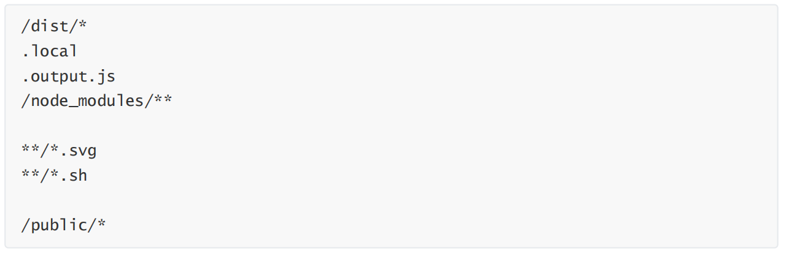
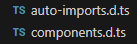
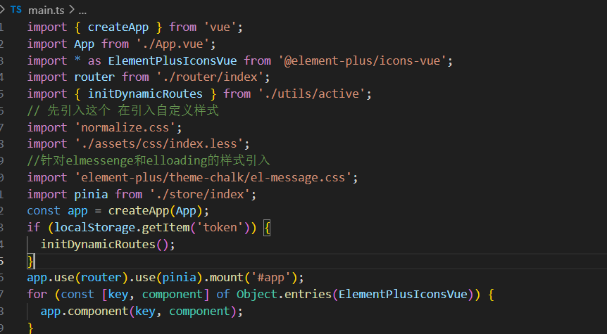

# 1.项目初始化

##  1.创建vue项目vite

**命令：npm init vue@latest**

创建成功后的界面：


## 2.tsconfig.json配置

### 1. 

 

### 2. 

 

------


## 3.代码规范

### 3.1集成EditorConfig配置

EditorConfig 有助于为不同 IDE 编辑器上处理同⼀项⽬的多个开发⼈员维护⼀致的编码⻛格。

```
# http://editorconfig.org
root = true
[*] # 表示所有⽂件适⽤
charset = utf-8 # 设置⽂件字符集为 utf-8
indent_style = space # 缩进⻛格（tab | space）
indent_size = 2 # 缩进⼤⼩
end_of_line = lf # 控制换⾏类型(lf | cr | crlf)
trim_trailing_whitespace = true # 去除⾏尾的任意空⽩字符
insert_final_newline = true # 始终在⽂件末尾插⼊⼀个新⾏
[*.md] # 表示仅 md ⽂件适⽤以下规则
max_line_length = off
trim_trailing_whitespace = false
```

​                      

VSCode需要安装⼀个插件：EditorConfig for VS Code


### 3.2使⽤prettier⼯具

Prettier 是⼀款强⼤的代码格式化⼯具，⽀持 JavaScript、TypeScript、CSS、SCSS、Less、JSX、

Angular、Vue、GraphQL、JSON、Markdown 等语⾔，基本上前端能⽤到的⽂件格式它都可以搞定，

是当下最流⾏的代码格式化⼯具。


#### 1.安装prettier

     


#### 2.配置.prettierrc⽂件：

```
useTabs：使⽤tab缩进还是空格缩进，选择false；

tabWidth：tab是空格的情况下，是⼏个空格，选择2个；

printWidth：当⾏字符的⻓度，推荐80，也有⼈喜欢100或者120；

singleQuote：使⽤单引号还是双引号，选择true，使⽤单引号；

trailingComma：在多⾏输⼊的尾逗号是否添加，设置为 none ，⽐如对象类型的最后⼀个属性后

⾯是否加⼀个，；

semi：语句末尾是否要加分号，默认值true，选择false表示不加；
```


#### 3.创建.prettierignore忽略⽂件



#### 4.VSCode需要安装prettier的插件


#### 5.VSCod中的配置


### 3.3使⽤ESLint检测

1.在前⾯创建项⽬的时候，我们就选择了ESLint，所以Vue会默认帮助我们配置需要的ESLint环境。

2.VSCode需要安装ESLint插件


3.解决eslint和prettier冲突的问题：

安装插件：（vue在创建项⽬时，如果选择prettier，那么这两个插件会⾃动安装）


添加prettier插件：

4.VSCode中eslint的配置


## 4.Css样式重置

```
npm i normalize.css
```

然后再入口文件中引入

```
import 'normalize.css';`
```

`normalize.css` 是一个 CSS 文件，用于标准化不同浏览器之间的默认样式。它可以帮助你消除浏览器间的不一致性，让你的网页在各种浏览器中表现一致，同时保留合理的默认样式。会在你的自定义样式之前加载，为你的 CSS 提供一个干净的起点。

然后在在css文件中一般创建三个文件夹

 

 

reset.less是重置基本样式内容如下：（可复用）

```
*,
*:after,
*:before {
    box-sizing: border-box;

    outline: none;
}

html,
body,
div,
span,
applet,
object,
iframe,
h1,
h2,
h3,
h4,
h5,
h6,
p,
blockquote,
pre,
a,
abbr,
acronym,
address,
big,
cite,
code,
del,
dfn,
em,
img,
ins,
kbd,
q,
s,
samp,
small,
strike,
strong,
sub,
sup,
tt,
var,
b,
u,
i,
center,
dl,
dt,
dd,
ol,
ul,
li,
fieldset,
form,
label,
legend,
table,
caption,
tbody,
tfoot,
thead,
tr,
th,
td,
article,
aside,
canvas,
details,
embed,
figure,
figcaption,
footer,
header,
hgroup,
menu,
nav,
output,
ruby,
section,
summary,
time,
mark,
audio,
video {
    font: inherit;
    font-size: 100%;

    margin: 0;
    padding: 0;

    vertical-align: baseline;

    border: 0;
}

article,
aside,
details,
figcaption,
figure,
footer,
header,
hgroup,
menu,
nav,
section {
    display: block;
}

body {
    line-height: 1;
}

ol,
ul {
    list-style: none;
}

blockquote,
q {
    quotes: none;

    &:before,
    &:after {
        content: '';
        content: none;
    }
}

sub,
sup {
    font-size: 75%;
    line-height: 0;

    position: relative;

    vertical-align: baseline;
}

sup {
    top: -.5em;
}

sub {
    bottom: -.25em;
}

table {
    border-spacing: 0;
    border-collapse: collapse;
}

input,
textarea,
button {
    font-family: inhert;
    font-size: inherit;

    color: inherit;
}

select {
    text-indent: .01px;
    text-overflow: '';

    border: 0;
    border-radius: 0;

    appearance: none;
    -webkit-appearance: none;
    -moz-appearance: none;
}

select::-ms-expand {
    display: none;
}

code,
pre {
    font-family: monospace, monospace;
    font-size: 1em;
}
```

## 5.配置路由和pinia

### 1.vue-router

```
npm i vue-router
```


然后在入口文件中use即可。


### 2.pinia

```
npm i pinia
```

1. 先创建一个大仓库，然后在入口文件中use

 

2. 在注册每个模块对应的小仓库

         

    

## 6.配置axios(封装一下)

### 1.先定义类型

```
文件名：type.ts

import type { InternalAxiosRequestConfig, AxiosResponse } from 'axios';

// 定义一个泛型接口 HYInterceptors，用于配置自定义拦截器函数
export interface HYInterceptors<T = AxiosResponse> {
  requestSuccessFn?: (config: InternalAxiosRequestConfig) => InternalAxiosRequestConfig;
  requestFailureFn?: (err: any) => any;
  responseSuccessFn?: (res: T) => T;
  responseFailureFn?: (err: any) => any;
}
// 定义一个泛型接口 HYRequestConfig，继承自 AxiosRequestConfig
// 新增一个可选的 interceptors 字段，类型为上面定义的 HYInterceptors<T>
// 这允许用户为特定请求配置单独的拦截器
export interface HYRequestConfig<T = AxiosResponse> extends InternalAxiosRequestConfig {
  interceptors?: HYInterceptors<T>;
```

### 2.然后在封装接口（创建一个类来封装）

```
import axios from 'axios';
// AxiosInstance 是 axios 库定义的一个接口类型，表示一个 Axios 实例的类型结构。
// 在定义变量、函数参数或返回值时，需要明确指定 Axios 实例的类型
import type { AxiosInstance } from 'axios';
import type { HYRequestConfig } from './type';

// 拦截器: Loading/token/修改配置

/**
 * 两个难点:
 *  1.拦截器进行精细控制
 *    > 全局拦截器
 *    > 实例拦截器
 *    > 单次请求拦截器
 *
 *  2.响应结果的类型处理(泛型)
 */

class HYRequest {
  // 指定 instance 属性的类型为 AxiosInstance
  instance: AxiosInstance;

  // request实例 => axios的实例
  constructor(config: HYRequestConfig) {
    this.instance = axios.create(config);

    // 每个instance实例都添加拦截器   全局拦截器
    this.instance.interceptors.request.use(
      (config) => {
   
        return config;
      },
      (err) => {
        return err;
      },
    );
    this.instance.interceptors.response.use(
      (res) => {
        return res.data;
      },
      (err) => {
        return err;
      },
    );
    
        实例拦截器
    // 针对特定的hyRequest实例添加拦截器
    // 从传入的配置对象 config 中获取 interceptors 下的 requestSuccessFn 和 requestFailureFn 作为请求拦截器。
    // 如果配置中有这些函数，会在全局请求拦截器之后执行，用于处理特定实例的请求相关逻辑。
    this.instance.interceptors.request.use(
      config.interceptors?.requestSuccessFn,
      config.interceptors?.requestFailureFn,
    );
    this.instance.interceptors.response.use(
      config.interceptors?.responseSuccessFn,
      config.interceptors?.responseFailureFn,
    );
  }

  // 封装网络请求的方法
  // T => IHomeData
  request<T = any>(config: HYRequestConfig<T>) {
    // 单次请求的成功拦截处理
    // 将 config 传入进行处理，处理后的结果重新赋值给 config 。
    // 这样可以在发起请求前对请求配置进行个性化的定制，比如添加特定请求的请求头、修改请求参数等。
    if (config.interceptors?.requestSuccessFn) {
      config = config.interceptors.requestSuccessFn(config);
    }

    // 返回Promise
    return new Promise<T>((resolve, reject) => {
      // 这里是原生的axios自带的request方法，上面的request方法只是对其进行了封装
      this.instance
        .request<any, T>(config)
        .then((res) => {
          // 单次响应的成功拦截处理
          // 将响应数据 res 传入进行处理，处理后的结果重新赋值给 res 。
          // 这可以用于对响应数据进行个性化的处理，比如数据格式化、提取特定字段等。
          if (config.interceptors?.responseSuccessFn) {
            res = config.interceptors.responseSuccessFn(res);
          }
          resolve(res);
        })
        .catch((err) => {
          reject(err);
        });
    });
  }

  get<T = any>(config: HYRequestConfig<T>) {
    return this.request({ ...config, method: 'GET' });
  }
  post<T = any>(config: HYRequestConfig<T>) {
    return this.request({ ...config, method: 'POST' });
  }
  delete<T = any>(config: HYRequestConfig<T>) {
    return this.request({ ...config, method: 'DELETE' });
  }
  patch<T = any>(config: HYRequestConfig<T>) {
    return this.request({ ...config, method: 'PATCH' });
  }
}

export default HYRequest;

```

### 3.通过另一个文件给类实例创建BASE_URL和TIME_OUT


### 4.创造类实例 使用


```
import { BASE_URL, TIME_OUT } from './config';
import HYRequest from './request';
import type { HYRequestConfig } from './request/type';

const hyRequest = new HYRequest({
  baseURL: BASE_URL,
  timeout: TIME_OUT,
} as HYRequestConfig);

export default hyRequest;

```

### 5.在类实例上添加拦截器的写法。

  


### 6.在单次请求上添加拦截器的写法

 


## 7.开发环境development与生产环境production

Vite会自己给我们提供一个环境变量，在一个特殊的对象上面暴露。

```
impot.meta.env
```

这里是一些所有情况下都能使用的内建变量，可以用他们判断处于什么环境下


## 8.element plus的集成引入(这个组件库专门做后台管理系统)

安装：`npm install element-plus`

看官网配置按需引入，引入后会自动生成两个文件：

 

如果想触摸组件时，有属性提示，需要把这两个文件放入tsconfig.json文件的编译配置include中


## 9.图标

 

注册： 


# 2.登录页面注意

## 1.布局

1.先在app中使得routerview充满整个屏幕

 

2.在写路由组件  路由组件同样填充满父容器 即app

 

3.再继续拆分调整样式即可


## 2.表单效验

1.`Form` 组件提供了表单验证的功能，只需为 `rules` 属性传入约定的验证规则，并将 `form-Item` 的 `prop` 属性设置为需要验证的特殊键值即可  支持正则表达式 也可以自定义效验规则，官网有格式


2.提交时，要整个效验一下表单的值是否合格，否则不能提交。 

这种情况下，要使用表单本身暴露的方法==validate==。

 或  

## 3.子组件对外暴露方法

```
//子组件

defineExpose（{
//这里写需要暴露的数据 和方法

}）
```

```
//父组件
1.获取子组件实例（采用ref） 所以可以在父组件中直接调用子组件暴露的方法和数据
2.注意：在使用ts定义子组件实例的类型时 要这样写 （PanAccount是子组件名）
```

 

## 4.使用elmessenage时

由于设置按需引入 所以要自己引入提示消息的样式

 

## 5.登录

### 1.登录状态的保存  

1. 一般将登录信息保存到store仓库中，如token name id....等等 并且一般网络请求也在pinia仓库中发，登录成功之后然后再跳转页面和保存token（刷新保持页面）

 

要保存token可使用l==ocalstorage==（本地）或者==sessionstorage==（会话框）

本地缓存：

```
localStorage.setItem('token',this.token)
```

 这样刷新后 就不会丢失token。

2. 路由跳转(先引入)

   ```
   router.push('/main')
   ```

3. 如果想退出登录同样跳转路由，再加上清除本地存储

    

### 2.路由守卫

#### 1.全局守卫

应用于所有路由，常用的有`beforeEach`（在路由切换前执行）和`afterEach`（在路由切换后执行）。

 

#### 2.路由独享守卫

要是你只需要对某个特定路由进行守卫，就可以使用路由独享守卫`beforeEnter`。

#### 3.组件内守卫

组件内守卫是定义在路由组件里的守卫，包含`beforeRouteEnter`、`beforeRouteUpdate`和`beforeRouteLeave`。

# 3. 权限管理

根据登录用户不同 呈现不同的内容 和给于不同的操作权限

专业名词：RBAC（role based access control）（基于角色的访问控制：给每个人分配角色，根据角色来分配权限），它是后端的东西和数据库有关。

通常是根据每个人的角色来获取权限。

根据后台传过来的数据，来动态展示路由，从而来控制每个角色的权限。

 

其中图标的渲染一般使用动态组件（vue中自带的）。如下图所示：

 

# 4.导航折叠

## 1.图标切换

 

## 2.自定义事件，传递参数，使得宽度切换。

**子组件：** 


**父组件：**

 

 

然后再操作elment-plus的属性（==collapse属性==），在折叠：

 

 


# 5.动态路由

作用：根据不同的用户 动态的注册不同的路由，而不是一次注册所有

1.基于角色动态路由管理，例如：


2.基于菜单的动态路由管理，例如：****


## 1.基于菜单动态路由的方式

###    1.先写好对应的页面 ，还要写好对应的路由文件

​         

路由（此时只是写好==并未注册==）：  


页面： 


## 2.从后台获取菜单（每个人不一样）


## 3.动态获取所有路由对象（也可自己全部写到数组中，不是自动化）

路由对象目前都在文件中，要从文件中将所有路由对象获取到数组中。==（一个新方法）==


------

  

------

 根据从后台获取的菜单，来筛选。


==关于刷新不会重新注册路由的bug：==

解决方法：1.在路由守卫中解决，但是要把逻辑写好否则会无限循环。例如：

 

2.在入口 文件调用，因为每次刷新入口文件的代码就会重新执行，但要判断是否有菜单和token，避免登录页面也调用，例：

  


==第一次登录时，需匹配到注册动态路由的第一个页面（因为当前第一次登录是显示空白）==

有很多方法。

# 6. 其他

## 1.作用域插槽

在elemnt-plus组件中，例如el-table，可用作用域插槽的 ==row== 属性来拿到指定数据的每一行的所有内容，来进行循环展示：


## 2.记得拿到组件实例可以调用方法和数据 这个方法

只不过需要在对应的组件中做暴露

## 3.在ts中父子组件用props传递数据时

### 1.只用类型参数

例如：定义接口

 

### 2.只用对象参数（需要运行时校验和默认值）

例子：


# 7 高级组件抽取配置与封装

封装后可通过传递配置配件，直接快速开发

## 1.改网络请求格式（以下是增删改查）


## 2.封装一个搜索框组件

例子：


这里通过父组件传递过来的数据，按情况进行组件的显示。

接受的数据：

在使用这个封装时,可以在想创造的组件同级写config.ts配置文件，如：

  


## 3.结合插槽的封装（可自定义内容）

结合插槽封装更灵活，需要预留插槽位，以及在配置文件中传递需要插槽，==然后支持开发者自定义插槽中的内容==

咧如：

这个例子==既用了作用域插槽==，来传递数据(子组件传递给父组件)，上图的v-bind='scop'，也可简写。然后父组件通过v-slot来接收数据，也可简写为#。

==也用了具名插槽==，父组件在使用时，要给插槽加上名字


# 8.按钮权限

每个不同的用户都对应不同的按钮权限。

先创建四个增删改查的布尔值对象： ，然后在根据后台反过来的数据，来判断改用户是否具有某个部分的按钮权限。这个判断过程可封装为一个函数。最后在对应的按钮上绑定v-if即可。

判断权限函数的例子：

调用：

也在组件中封装好，使用时只需要在config文件中配置即可。

即:用户传递一个权限的id，然后该函数能从后台数据中寻找，如果有该id即返回true，没有就返回false。

此方法需要后台的数据 返回值中包括改按钮的唯一标志。

#  9. hooks的作用和写法

特点：命名以use开头，把组件里的通用逻辑（如请求数据、监听滚动、管理表单）抽成 Hooks，哪里需要哪里用。

例子：

在组件中引入后直接使用即可：


# 10.nextTick函数

Vue 的**响应式更新是异步执行的**。当你修改响应式数据时，DOM 不会立即更新，而是会等所有数据变化完成后，**批量更新 DOM**（这样可以避免频繁操作 DOM 导致性能问题）。

因此，如果在修改数据后立即访问 DOM，可能会获取到旧的 DOM 状态。这时就需要用 `nextTick` 来==确保 DOM 已经更新完毕。==
